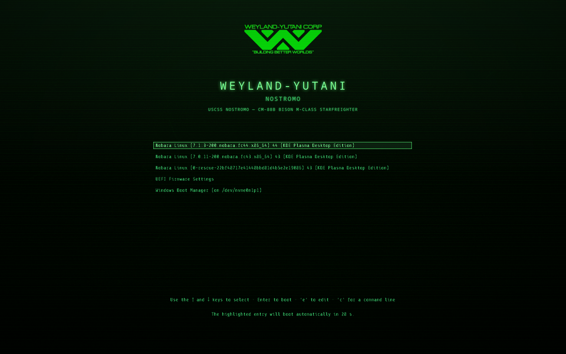
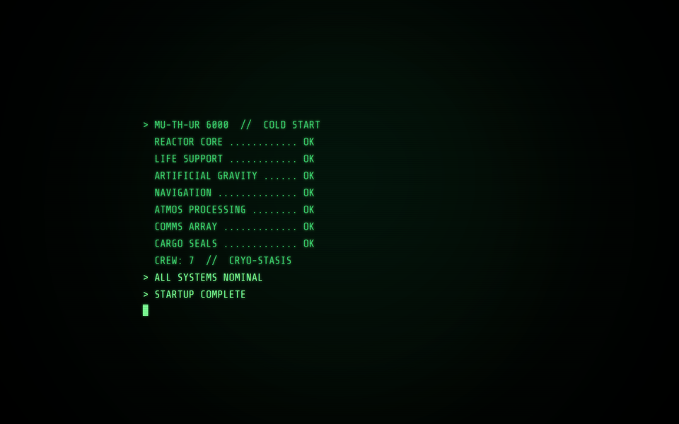
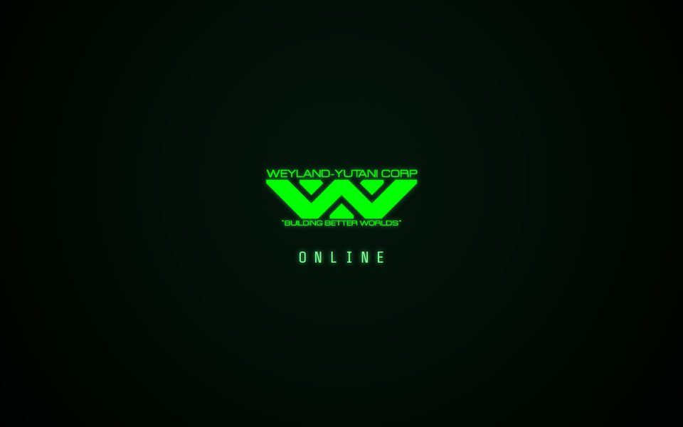
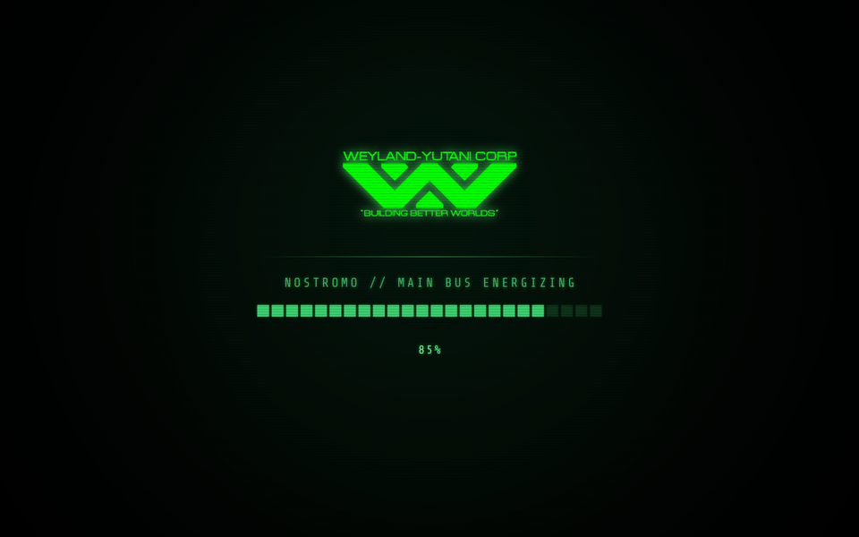
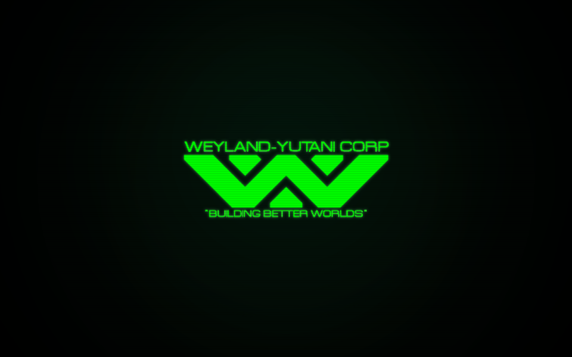

# WEYLAND-YUTANI CRT for Nobara Linux

**An *Alien* / Nostromo phosphor-green CRT boot experience for Nobara Linux (KDE Plasma).**

A cohesive theme that dresses up your whole startup in the *Weyland-Yutani* / MU-TH-UR
aesthetic - rolling scanlines, a soft phosphor sweep, and the winged-W emblem - from the
moment you power on to the moment your desktop appears.



---

## What's included

The theme covers the three screens you see while the machine starts, in order:

1. **GRUB boot menu** - the themed entry picker (above), the first thing on screen. **3 menu-font options** (default, bigger, or an alternate typeface).
2. **Boot splash** (Plymouth) - shown *before login* while the kernel and system load. **7 styles.**
3. **Plasma splash** (KDE) - the "Splash Screen" shown *after login* while the desktop loads. **4 styles.**

Every splash carries the rolling CRT scanline grille + sweep band — and you can turn it **off**
for a clean, flat screen if you prefer (the Plasma **System Online** style is always clean). Pick
any boot splash and any Plasma splash independently.

It's all built on a **handmade Weyland-Yutani CRT wallpaper** (an original 5120×1440 piece) -
every GRUB, boot, and splash background is derived from it. The [`wallpaper/`](wallpaper/) folder
ships it for your desktop too, along with **several still variants** (logo / no-logo, textured,
brighter) and a **seamless looping video wallpaper** (`weyland-crt-loop.mp4`) where a soft phosphor
sweep drifts down the screen. Set a still image with `plasma-apply-wallpaperimage <file>`; play the
video with a KDE video-wallpaper plugin. See [`wallpaper/README.txt`](wallpaper/README.txt).

Plus **[`index.html`](index.html)** - an interactive picker that previews every option and prints
the exact install commands for whatever you choose (see below).

https://github.com/user-attachments/assets/af00250e-4542-4cee-8865-e11e8d3e533a

---

## Screenshots

|  |  |
|---|---|
| **MU-TH-UR Console** - ship-computer self-test<br> | **System Online** - the emblem powers on<br> |
| **Nostromo** - power gauge energizing<br> | **Emblem Ignition** - minimal, logo-led<br> |

---

## Preview, pick and see install commands in `index.html`

**Start here.** Download this repo, then open **[`index.html`](index.html)** in any browser. It's an
interactive picker that animates every option live and lets you choose one of each:

- a **GRUB menu**,
- a **boot splash** (Plymouth, before login),
- and a **Plasma splash** (KDE, after login) (you can choose all of these and select them in the system settings).

Set your **RESOLUTION** at the top (1080p, 1440p, ultrawide, 4K, 32:9 and more) so the preview
matches your display, and toggle **CRT LINE** on/off. As you pick, it **prints the exact install
commands** for your selection — including the extra lines for the variant you chose — ready to
copy and paste into a terminal. Preview first, choose what you like, then run what it gives you.

Also handy:
- After installation, any and all KDE Plasma Splash screens will be found in System Settings - Color & Themes - Splash Screen.

### Two build variants

Two independent switches, both offered in the picker (and documented in [INSTALL.txt](INSTALL.txt)):

- **Backgrounds — Native vs Optimized.** Every background is a 5120×1440 master that crop-fits to
  any screen. *Native* is full quality (~4 MB each); *Optimized* looks identical but is ~14× smaller
  (~290 KB), which also shrinks the boot image. The optimized set lives in [`optimized/`](optimized/).
- **CRT line — On vs Off.** Keep the rolling scanline grille + phosphor sweep band, or drop it for a
  clean flat screen. (GRUB has no CRT overlay; the Plasma **System Online** style is always clean.)
- **Splash size — Small / Medium / Large.** Scales the whole splash content — console text, progress bar,
  power gauge, standby meter, the ONLINE text, the Weyland emblem, and the password/LUKS unlock dialog.
  Medium is the default. GRUB has its own font sizes above.

---

## Requirements

- A **Fedora-based** distro. This has only been tested on **Nobara Linux** (KDE Plasma edition).
- **KDE Plasma 6** (for the Plasma splash; the GRUB + boot splashes are DE-agnostic).
- **GRUB2** and **Plymouth**, plus `plymouth-plugin-script` and `plymouth-plugin-label`
  (installed by the boot-splash step below - without the label plugin the text splashes render blank).

---

## My favourite setup

**MU-TH-UR Console** boot splash + **System Online** Plasma splash - the ship's computer runs
its startup self-test as you boot, then the emblem powers on as your desktop comes up (it is also short enough to be a meaningful after-login splash. 

---

## All options

### GRUB menu font

The GRUB entry picker comes in three menu-font layouts — pick one in `index.html` (it points `GRUB_THEME` at the matching file):

| Variant | Font | Theme file |
|---|---|---|
| **Default** | Share Tech Mono 16 | `theme.txt` |
| **Bigger font** | Share Tech Mono 24 — more readable | `theme-bigfont.txt` |
| **Alt font** | JetBrains Mono 18 — a different typeface | `theme-altfont.txt` |

> **Ultrawide / stretched menu?** GRUB has to run at your monitor's *native* resolution —
> firmware "auto" modes are usually 4:3/16:9, and an ultrawide panel stretches those to fill
> the screen (stretched fonts + title, and the boot splash starting small in a corner).
> The install steps now set `GRUB_GFXMODE` to the native mode automatically; if it still looks
> stretched, press `c` at the GRUB menu and run `videoinfo` to see which modes your firmware
> actually supports.

### Boot splashes (Plymouth - before login)

| Theme | Style |
|---|---|
| `weyland-muthur` | **MU-TH-UR Console** - ship computer self-test → `STARTUP COMPLETE` |
| `weyland-online` | **System Online** - the Weyland-Yutani logo powers on + `ONLINE` |
| `weyland-nostromo` | **Nostromo** - emblem + power gauge energizing 0→100% |
| `weyland-ignition` | **Emblem Ignition** - the logo powers on. Minimal |
| `weyland-console` | **Console Log** - green boot log types out as the system loads |
| `weyland-bar` | **Progress Bar** - minimal bar that fills with boot progress |
| `weyland-standby` | **Standby Meter** - segmented meter, follows boot load 0→100% |

Switch splash any time: `sudo plymouth-set-default-theme -R weyland-<name>`

### Plasma splashes (KDE - after login)

| Theme | Style |
|---|---|
| `weyland-muthur` | **MU-TH-UR Console** - ship computer self-test |
| `weyland-online` | **System Online** - the logo powers on + `ONLINE` (clean, no scanlines) |
| `weyland-nostromo` | **Nostromo** - emblem + power gauge |
| `weyland-ignition` | **Emblem Ignition** - the emblem powers on |

Or pick one visually in **System Settings › Colors & Themes › Splash Screen** (hit ▶ to preview).

---

## Updating

Already installed an older version? The installed files are **copies** (and the boot
splash is baked into the boot image), so pulling fixes here changes nothing until you
re-run the install commands for the parts you use — the `cp` steps **plus** the
activation step (`grub2-mkconfig` for GRUB, `plymouth-set-default-theme -R` for the
boot splash; the Plasma splash is just the `cp`).

---

## Reverting / uninstalling

Run everything from **inside this folder**. Each block is self-contained - paste the whole
thing and you're back to stock. Do all three to remove the theme completely, or just the one
you want to undo.

**1 · GRUB menu** - restores the default boot menu
```bash
sudo rm -rf /boot/grub2/themes/weyland-crt
sudo sed -i '/^GRUB_THEME=/d' /etc/default/grub
sudo sed -i '/^GRUB_GFXMODE=/d' /etc/default/grub
sudo sed -i '/^GRUB_GFXPAYLOAD_LINUX=/d' /etc/default/grub
sudo sed -i 's/^#GRUB_TERMINAL_OUTPUT=/GRUB_TERMINAL_OUTPUT=/' /etc/default/grub
sudo grub2-mkconfig -o /boot/grub2/grub.cfg
```

**2 · Boot splash (Plymouth)** - restores the default Fedora/Nobara splash
```bash
sudo plymouth-set-default-theme -R bgrt
sudo rm -rf /usr/share/plymouth/themes/weyland-*
```

**3 · Plasma splash (KDE)** - no root, no reboot
```bash
kwriteconfig6 --file ksplashrc --group KSplash --key Theme Breeze
rm -rf ~/.local/share/plasma/look-and-feel/weyland-*
kbuildsycoca6
```

Reboot to confirm everything is back to stock.

---

## Notes & credits

- **Wallpaper & CRT artwork - original, handmade by the theme's author.** The phosphor-green,
  scanlined background the entire theme is built on is hand-made original art (5120×1440 master);
  every GRUB / boot / splash background is derived from it.
- Fonts: **Share Tech Mono** and **JetBrains Mono** (both SIL Open Font License).
- A fan project - *Weyland-Yutani* and *Alien* are trademarks of 20th Century Studios; this is
  unofficial and not affiliated with or endorsed by the rights holders.
- Built and profiled on Nobara Linux / KDE Plasma 6. Full install reference: **[INSTALL.txt](INSTALL.txt)**.
